# GPU Driven Terrain 入门

最近看了育碧在GDC上分享的关于[孤岛惊魂5地形渲染的PPT](https://www.gdcvault.com/play/1025480/Terrain-Rendering-in-Far-Cry)。以前我没有接触过大世界地形渲染相关技术，于是就动手实践一下。权且当做一个GPU Driven Terrain 入门。

本项目当前包含:

- LOD四叉树构建
- 视锥裁剪
- Hiz遮挡裁剪
- LOD接缝处理

本项目当前不包含:

- 节点资源Stream 
- 材质渲染

所有的计算都由GPU实现，且不存在CPU数据回读。

文章会引用PPT中的一些图片，在实现上大致应该与PPT所述相同，在细节上可能会有些出入，请自行甄别。

先放一个Preiview:


注意，这只是一个技术实验项目，请谨慎参考。

# 1. LOD

这里我们要渲染的世界大小为10240m x 10240m，称之为`World`。

我们手头有一张16x16个格子组成的Mesh，大小为8m x 8m，每个格子分辨率为0.5m。我们称之为`Patch`。

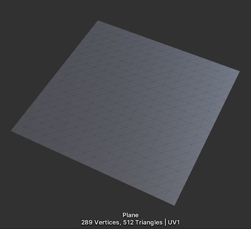

假如我们用这个Patch铺满整个世界，那么总共要1280 x 1280 = 1638400块。这个数量是巨大的，电脑会直接炸掉。

为了提升性能，于是引入了LOD(Level Of Detail)的概念。即远处的地块采用低分辨率网格(可以通过放大Patch实现)，近处采用高分辨率网格。LOD四叉树即是其中一种实现方式。

# 1.1 LOD四叉树

我们首先将世界在xz平面上分割成相等的5 x 5块相同的区域，每个区域视作一个Node，25个Node构成了四叉树的第一层，记为LOD5。

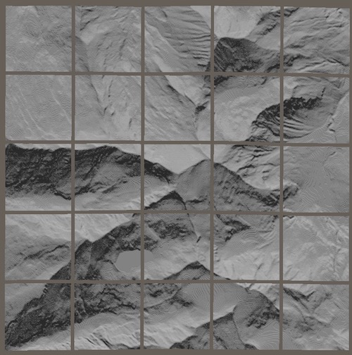

然后遍历这25个节点，根据一定规则进行评价，决定是否对节点进行4叉分割。通常评价的标准有:

- 与摄像机的距离
- 高度变换剧烈程度
- etc..

本项目仅使用与摄像机距离来判定是否分割。这样我们就得到了LOD4的节点.

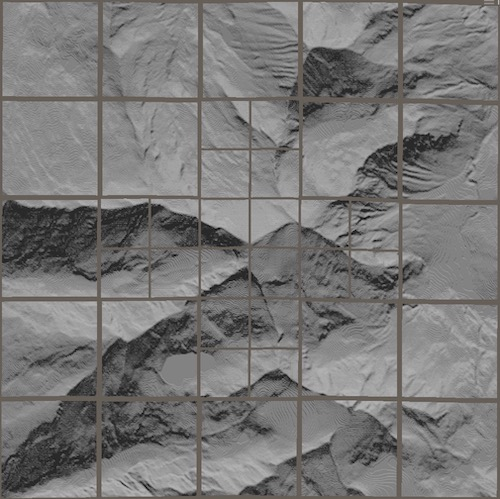

如此重复下去，直到LOD0，我们就得到了一颗LOD四叉树。我们将不同的LOD节点用不同的颜色表示出来，如下图所示:

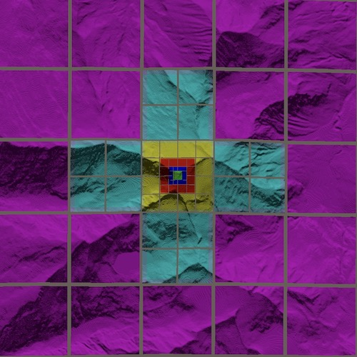

- 对于LOD0的Node，我们使用原分辨率的Patch进行平铺渲染，一个网格分辨率为0.5m
- 对于LOD1的Node，我们使用Scale为2的Patch平铺渲染，一个网格的分辨率为1m
- .....
- 对于LOD5的Node，我们使用Scale为2^5的Patch平铺渲染，一个网格分辨率为16m

易知，每个Node由8x8=64块Patch构成。


根据以上简单的描述，我们可以有以下的尺寸概念:

- `World`大小为 10240m x 10240m

- `QuadTree` 有6层，从上往下分别代表`LOD5~LOD0`。
- LOD5有25个Node,往下依次x2，直到LOD0有160x160个Node
- 单个Node的覆盖范围从`LOD5~0`依次为`[2048m,1024m,512m,256m,128m,64m]`
- 我们称64m x 64m为Sector，即LOD0的Node大小
- 在实际渲染的时候，我们会将Node打散成8x8共64个Patch作为基础单位提交给GPU进行Instance渲染。

# 1.2 GPU四叉树分割

在Unity中我们使用ComputeShader来对四叉树进行节点分割计算。我们可以准备以下三个Buffer结构:

```hlsl
uniform uint PassLOD;
ConsumeStructuredBuffer<uint2> ConsumeNodeList;
AppendStructuredBuffer<uint2> AppendNodeList;
AppendStructuredBuffer<uint3> AppendFinalNodeList;
```

其中:

- PassLOD为当前执行的LOD级别
- Consume和Append以uint2作为元素，代表当前LOD下Node的二维索引
- AppendFinalNodeList以uint3作为元素，其中z表示Node的LOD，xy代表二维索引


具体算法如下:

1. 将当前PassLOD设为5
2. 执行Dispatch
3. 从ConsumeNodeList中获取节点，对节点进行评价，决定是否分割。
4. 如果决定分割，那么将分割后的4个节点加入AppendNodeList
5. 否则将当前节点加入AppendFinalNodeList
6. Dispatch结束
7. 将当前PassLOD减1，互换ConsumeNodeList和AppendNodeList，回到2执行下一个Pass

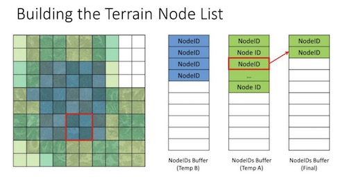

kernel代码如下:

```hlsl
[numthreads(1,1,1)]
void TraverseQuadTree (uint3 id : SV_DispatchThreadID)
{
    uint2 nodeLoc = ConsumeNodeList.Consume();
    if(PassLOD > 0 && EvaluateNode(nodeLoc,PassLOD)){
        //divide
        AppendNodeList.Append(nodeLoc * 2);
        AppendNodeList.Append(nodeLoc * 2 + uint2(1,0));
        AppendNodeList.Append(nodeLoc * 2 + uint2(0,1));
        AppendNodeList.Append(nodeLoc * 2 + uint2(1,1));
    }else{
        AppendFinalNodeList.Append(uint3(nodeLoc,PassLOD));
    }
}
```

- 其中`EvaluateNode`为节点评价函数

这样每个Dispatch完成一个LOD级别的分割，总共使用6次Dispatch就完成了四叉树的分割。

# 1.3 节点评价

作为Demo，我们只使用节点中心到摄像机的距离作为评价标准。实际项目中需要根据需求进行编写。

我们的评价公式如下:

```
f = d / (n * c);
```
其中d为摄像机到节点中心距离，n为节点边长，c为用户控制系数。

当f < 1时，则对节点进行分割。易知，c越大，节点越容易被分割。

# 1.4 NodeDescriptor

在实际应用中，我们需要为一个结构来存储节点的一些额外信息，例如:

- 材质索引
- LOD Bias
- etc...


在本Demo中，由于暂不涉及材质处理，我们的NodeDescriptor仅有如下简单的结构:

```hlsl
struct NodeDescriptor{
    uint branch;
};
```
branch字段代表节点是否进行了分割。在后面生成LOD Map的时候会用到。

但是我们要如何完成Node到Descriptor映射查找呢？

在GPU中没有Map这种结构，我们无法使用uint3去索引NodeDescriptor。因此我们需要建立一个`uint3 -> uint`的映射，然后将`uint`作为数组下标去索引NodeDescriptor Buffer。

我们使用一个简单的公式就能完成`uint3->uint`的映射:

```hlsl
uint nodeIdOffsetLOD[6] = [8525,2125,525,125,25,0];
uint nodeCountLOD[6] = [160,80,40,20,10,5];

.......

uint3 nodeLoc;
uint nodeId = nodeIdOffsetLOD[nodeLoc.z] + nodeLoc.y * nodeCount + nodeLoc.x
```
这样我们就得到了nodeId。然后我们定义一个NodeDescriptors Buffer

```hlsl
RWStructuredBuffer<NodeDescriptor> NodeDescriptors;
```
其大小为所有LOD节点个数之和，即:

```
5x5+10x10+20x20+40x40+80x80+160x160 = 34125
```
然后使用nodeId对其进行读写即可。


## 1.4 生成Patch列表

在完成四叉树分割之后，我们得到了FinalNodeList列表。如我们前面所述,LOD0级别的Node，其大小也有64m x 64m。作为最小渲染单位还是太大了。因此我们需要将其打散成更小的单位，称之为Patch。

一个Node打散成8x8=64个Patch作为最小渲染单位。针对单个Node，完整的流程图如下:

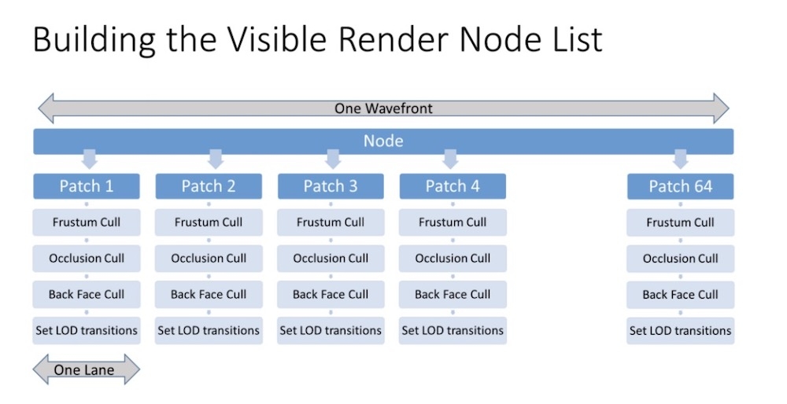

剪裁之类的我们先不管，先把地块渲染出来再说。

首先我们将FinalNodeList的Counter拷贝给IndirectArgs，代表我们要起的线程组数量:

```csharp
_commandBuffer.CopyCounterValue(_finalNodeListBuffer,_indirectArgsBuffer,0);
```

即每个Node对应一个ThreadGroup。

然后针对每个ThreadGroup将线程数设为:

```hlsl
[numthreads(8,8,1)]
```
这样一共64个线程，每个线程对应一个Patch。 然后开始Dispatch.

```hlsl
[numthreads(8,8,1)]
void BuildPatches(uint3 id : SV_DispatchThreadID,uint3 groupId:SV_GroupID,uint3 groupThreadId:SV_GroupThreadID){
    uint3 nodeLoc = FinalNodeList[groupId.x];
    uint2 patchOffset = groupThreadId.xy;
    //生成Patch
    RenderPatch patch = CreatePatch(nodeLoc,patchOffset);
    CulledPatchList.Append(patch);
}
```

其中:

- groupThreadId.xy代表了patch在Node局部空间的二维索引.

利用简单的数学知识，我们就能计算出Patch的世界坐标。然后得到如下RenderPatch结构:

```hlsl
struct RenderPatch{
    float2 position; //世界坐标
    uint lod; // lod决定了这个Patch的Scale
};
```

然后我们可以使用`Graphics.DrawMeshInstancedIndirect`直接对`StructuredBuffer<RenderPatch>`进行渲染。

## 1.5 Patch渲染

编写一个Terrain.shader.基本定义如下:

```hlsl
StructuredBuffer<RenderPatch> PatchList;
struct appdata
{
    float4 vertex : POSITION;
    float2 uv : TEXCOORD0;
    uint instanceID : SV_InstanceID;
};
```

- PatchList是我们在1.4中计算出来的Patch列表
- instanceID为GPU Instance ID，可以用来索引PatchList

在顶点着色器中，使用以下简单的代码，即可完成Patch的位置偏移和LOD缩放
```hlsl
RenderPatch patch = PatchList[v.instanceID];
uint lod = patch.lod;
float scale = pow(2,lod);
inVertex.xz *= scale;
inVertex.xz += patch.position;
o.vertex = TransformObjectToHClip(inVertex.xyz);
```

这样就能得到一个初步渲染效果如下:

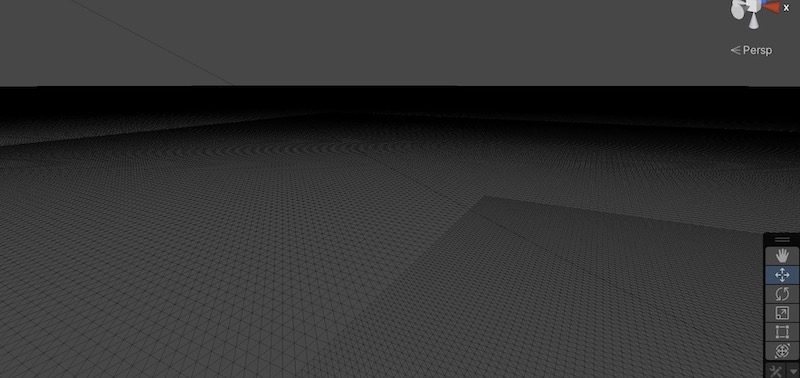
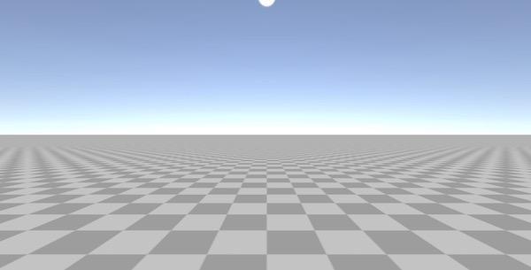

当摄像机在场景内移动时，我们看一下动态节点分割效果:


# 2. 高度图实现

由于我手头没有合适的资源，就从网上随便下载了一个高度图:

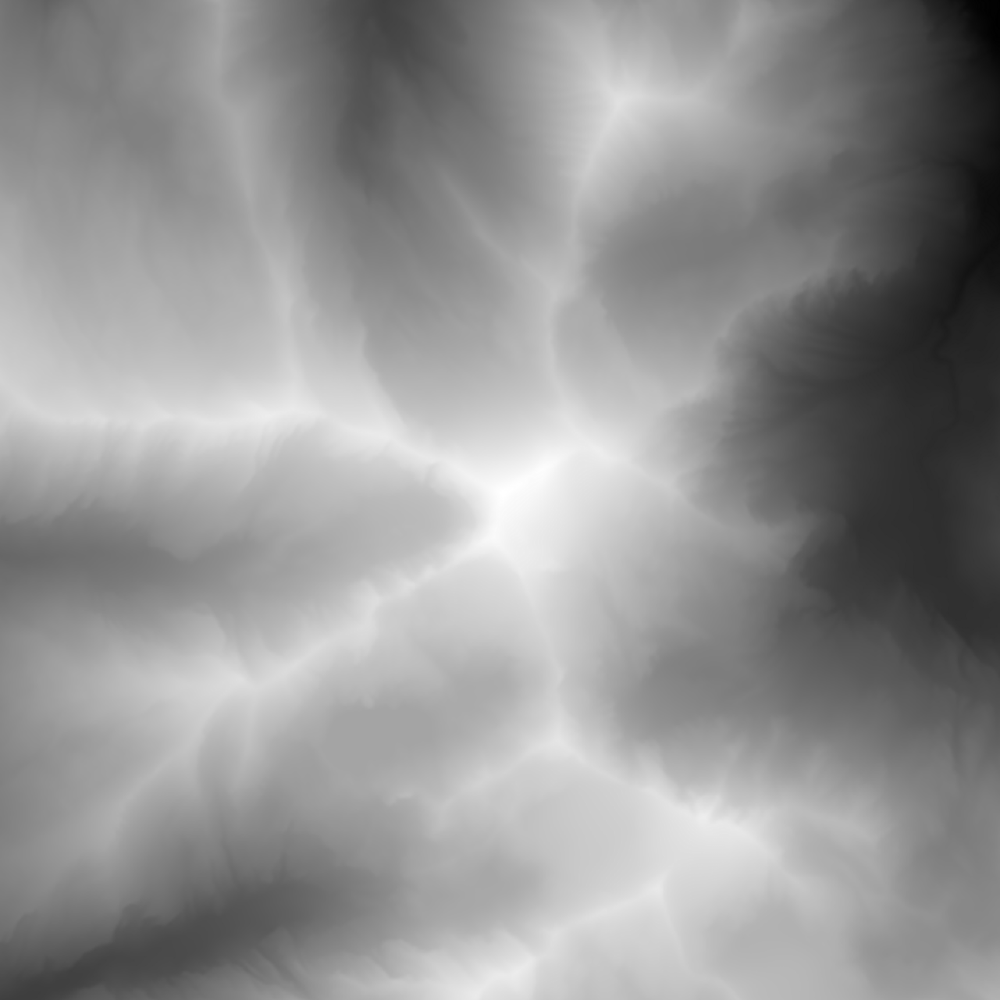

这张高度图的分辨率为1281x1281，使用R16格式保存。我直接将其应用于整个世界，相当于每个像素对应的范围为8m x 8m，精度是很低的，先凑活用吧。 在实际项目中，应当是按LOD加载对应区域高度图。

高度图的使用很简单，我们根据顶点的xz坐标，利用以下公式计算得到高度图的uv:
```hlsl
float2 heightUV = (inVertex.xz + (_WorldSize.xz * 0.5) + 0.5) / (_WorldSize.xz + 1);

```
然后去采样高度图得到一个范围为`0~1`的值。将其乘以预配置的地形最大高度，得到一个世界高度值。然后对顶点进行偏移即可:

```hlsl
float height = tex2Dlod(_HeightMap,float4(heightUV,0,0)).r;
inVertex.y = height * _WorldSize.y;
```
跑一下后，我们会发现一个问题，原来在平面上实现的四叉树分割失效了:

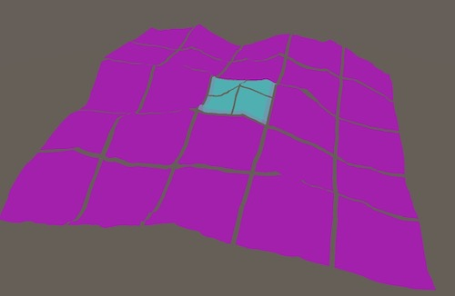

到LOD4就不往下了。

这是因为，在平面上实现的时候，我们计算摄像机与节点中心距离无需考虑高度。但是当地形有了高度之后，我们必须估算出节点的中心高度，才能算得准确的LOD。为了实现这个目标，我们需要建立起Node的包围盒。

## 2.1 MinMaxHeightMap

Node在xz平面上的最小和最大值我们很容易就可以求得(因为是规则的四叉树格子分割)。因此只需要计算出minHeight和maxHeight，就可以成功构建包围盒了，这个过程可以通过对高度图进行离线预计算得到，我们将其存为MinMaxHeightMap，格式为RG32，R分量为minHeight，G分量为maxHeight。

由于Node是有LOD结构的，因此对应过来，MinMaxHeightMap是具有Mips结构的。

MinMaxHeightMap生成原理如下:

- 采样HeightMap的相邻4个像素高度值，注意HeightMap中的像素对应的是Vertex的高度.
- 计算出4个Vertex高度的min和max，分别存入MinMaxHeightMap的RG分量.

因此1281 x 1281的高度图，将生成一张1280 x 1280的 MinMaxHeightMap。

MinMaxHeightMap中的一个像素，代表了一个8m x 8m范围的高度分布。

然后我们对MinMaxHeightMap进行Mips生成，4个像素合并成一个像素，规则为R分量取min，G分量取max。 这样我们就得到Mip级数为9的MinMaxHeightMaps:

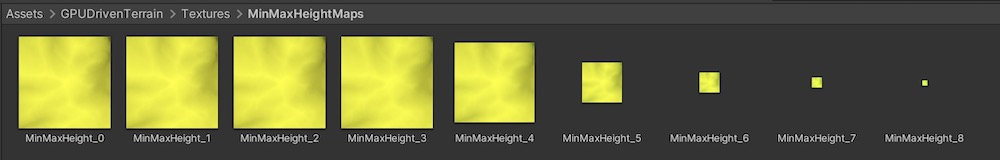

其中LOD为0的Node对应的MinMaxHeight Mip应该为3，然后依次往上。

通过MinMaxHeightMap，我们就能轻易构建Node的包围盒，并进行正确的节点评价计算。四叉树分割Debug效果如下:

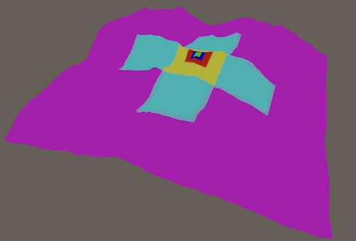

## 2.2 法线图

到目前位置，我们从摄像机视角去看的渲染效果图如下:

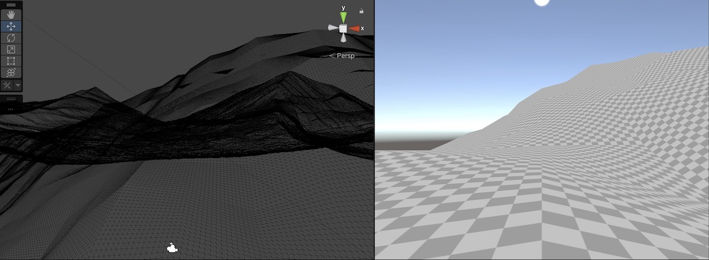

由于Demo使用的高度图精度很低，近距离看地面高度过渡会不自然。不过因为只是Demo，我们理解原理就可以了。另一方面现在没有法线效果，看起来很平。我们可以写一个小小的工具，从高度图生成法线图，源代码可以参考项目中的`HeightToNormal.compute`，这里不贴了。

生成的法线图如下:

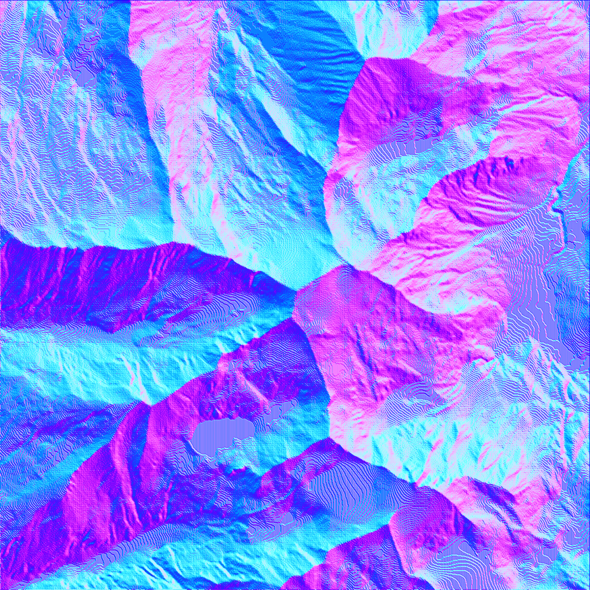

法线图我们使用RG32格式，其中R保存x分量，G保存z分量。

有了法线图后，我们使用简单的Diffuse光照模型对地形进行渲染，效果如下:

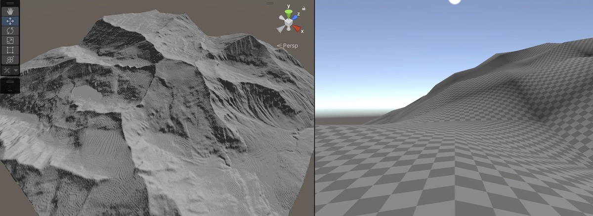

如前面所述，因为法线图分辨率实在太低了，所以近看还是比较糟糕的，但是远看整个明暗效果还可以，毕竟本文的主旨不在于材质光照着色，我们有一个可以凑活看的效果就可以了。

开启Patch Debug，看一下整个场景的LOD和Patch分布情况:

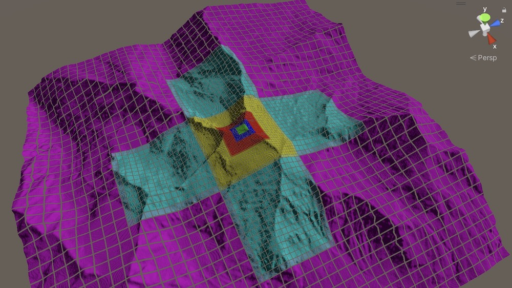

如果从GPU中回读PatchIndirectArgsBuffer进行打印，可以发现当前总共进行渲染的Patch数量为`5632`个。这与我们开头给出的`1638400`块相比，已经得到了巨大的提升。

但优化空间还是很多的，比如各种裁剪我们都还没有做。

# 3. 裁剪

在Far Cry 5中总共有三种剪裁: 

- Frustum Cull
- Hiz Occlusion Cull
- Back face Cull

这里我们只实现Frustum Cull和Occlusion Cull。

## 3.1 Patch包围盒

为了完成相关裁剪，我们必须构建Patch的包围盒，原理与前面的Node包围盒相同，但是在实际操作的时候发现由于精度问题会导致包围盒无法完整围住Patch，特别是在LOD0的时候。为了对Patch包围盒有一个可视化的效果供Debug，Demo中额外增加了一个BoundsBuffer进行渲染。Debug效果如下:

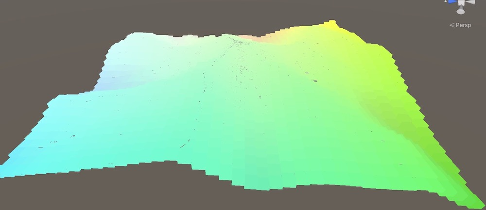

其中一些灰点即是没有被Bounds包住的露出来的地面。

为了修正这个问题，在Shader中额外增加了一个参数`_BoundsHeightRedundance`来控制包围盒在高度方向的冗余度。包围盒的Top和Bottom两个平面会向外偏移一定距离以修正精度引起的问题。

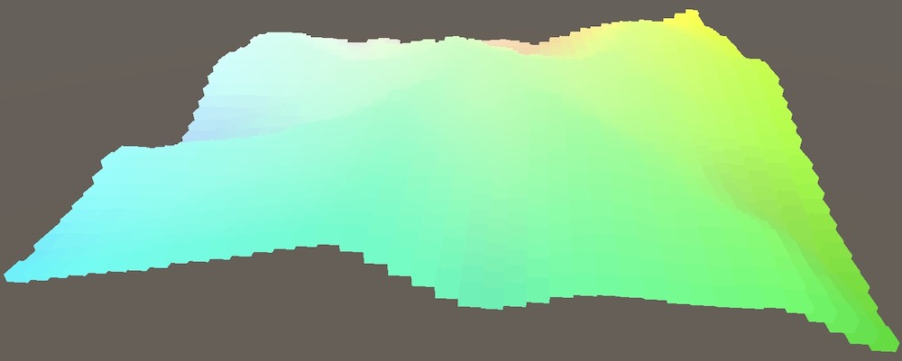

通过对包围盒进行可视化绘制，我们确认了包围盒数据得到了正确生成。

## 3.2 视锥裁剪

接下来要针对包围盒进行视锥裁剪。

视锥裁剪的原理是比较简单的:

- 摄像机视锥由6个平面围成，平面法线朝内。
- 一个AABB包围盒由8个顶点构成。
- 我们依次判定包围盒与每个平面的关系
- **只要存在一个平面，使得8个顶点都在这个平面的外侧，那么这个物体就在视锥之外.**

在C#端，我们可以通过`GeometryUtility.CalculateFrustumPlanes(camera,_cameraFrustumPlanes);`获取到`Plane[6]`结构，代表了摄像机视锥的6个平面。

但是GPU中只能使用float4结构，因此需要将Plane转为Vector4.

实际上，一个平面可以有公式`Ax + By + Cz + D = 0`构成，ABCD正好为4个系数。更进一步，其实(A,B,C)构成了平面的法线,而D代表了原点到平面的距离(有符号，法线为正方向)。

因此我们可以使用以下转换将`Plane[6]`转为`Vector4[6]`传给Shader使用:

```
var v4 = Vector4(plane.normal,plane.distance)
```

然后在Shader中，我们使用以下函数判定一个点在平面外侧(负法线方向)还是内侧(正法线方向):

```hlsl
//测试点是否在平面的外侧
bool IsOutSidePlane(float4 plane,float3 position){
    return dot(plane.xyz,position) + plane.w < 0; 
}
```

然后我们依次判定包围盒的8个顶点，就能检测一个包围盒是否完全位于平面外面。最终得到的视锥裁剪函数如下:

```hlsl
//视锥裁剪
bool FrustumCull(float4 planes[6],Bounds bounds){
    return IsBoundsOutSidePlane(planes[0],bounds) || 
    IsBoundsOutSidePlane(planes[1],bounds) || 
    IsBoundsOutSidePlane(planes[2],bounds) || 
    IsBoundsOutSidePlane(planes[3],bounds) || 
    IsBoundsOutSidePlane(planes[4],bounds) || 
    IsBoundsOutSidePlane(planes[5],bounds);
}
```

视锥裁剪效果动画:


## 3.3 Hiz遮挡裁剪

Hiz指的是Hierarchical depth。其原理是利用上一针的深度图，生成类似Mips的结构。但是Mips的算法与传统的贴图Mips稍有不同: **取4个像素中最远的那个像素写入下一级Mip.**

易知:

- 最高级Mip为1x1的深度图，其代表了整个屏幕中最远距离
- 次高级Mip为2x2的深度图，4个像素依次代表将屏幕4叉分割后，每块区域各自的最远距离.
- ....

那么当我们有了所有级别的Hiz Map后，我们在GPU中要如何对一个物体进行遮挡裁剪呢?

- 首先可以将物体的包围盒8个顶点投影到屏幕空间，得到屏幕空间的8个点。
- 针对这8个点建立屏幕空间的AABB Box，得到一个屏幕空间矩形.
- 根据这个矩形的最大边长，我们可以计算出一个合适的Mip。在这个Mip下，矩形的4个顶点恰好满足位于相邻的像素。
- 依次对4个顶点进行深度测试，如果均未通过，那么就意味着这个物体被完全遮挡。
 
     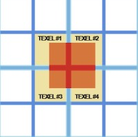

### 3.3.1 HizMapPass
实际上Hierarchical depth Buffer除了做遮挡剔除，还有许多其他的用处。在管线中通常可以作为一种基础功能提供，而不要耦合与任何一个模块。

在URP中，我们可以创建一个RenderFeature，来专门生成HizMap。我们将这个HizMap Pass放到透明物体渲染之前:

```csharp
this.renderPassEvent = RenderPassEvent.BeforeRenderingTransparents;
```

在执行HizMapPass前，首先要申请一张RenderTexture。为了方便做Mips，这张Texture需要满足2的幂次大小。由于屏幕大小通常不满足这个条件的，因此我们取屏幕的较长边，并计算器其NextPowerOfTwo，作为RT的大小。

```csharp
public static int GetHiZMapSize(Camera camera){
    var screenSize = Mathf.Max(camera.pixelWidth,camera.pixelHeight);
    var textureSize = Mathf.NextPowerOfTwo(screenSize);
    return textureSize;
}
```

第一步我们先将深度图Blit到申请的这张RT中:
```csharp
_commandBuffer.Blit(ShaderConstants.CameraDepthTexture,hizMap);
```

然后利用ComputeShader反复生成下一级Mip就可以了:

```csharp
_commandBuffer.SetComputeTextureParam(_computeShader,0,ShaderConstants.InTex,hizMap);
for(var i = 1; i < hizMap.mipmapCount;i++){
    width = Mathf.CeilToInt(width / 2.0f);
    height = Mathf.CeilToInt(height / 2.0f);
    _commandBuffer.SetComputeIntParam(_computeShader,ShaderConstants.Mip,i);
    _commandBuffer.SetComputeTextureParam(_computeShader,0,ShaderConstants.ReduceTex,hizMap,i);
    var groupX = Mathf.CeilToInt(width * 1.0f / threadX);
    var groupY = Mathf.CeilToInt(height * 1.0f / threadY);
    _commandBuffer.DispatchCompute(_computeShader,0,groupX,groupY,1);
}
```

在FrameDebugger中查看生成的HizMap:

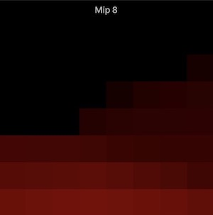

为了供其他模块访问, HizMapPass会将以下三个变量写入全局Shader环境:

- _HizCameraMatrixVP - 生成HizMap使用的摄像机ViewProject矩阵
- _HizMap - Hiz深度图
- _HizMapSize - Hiz深度图大小

### 3.3.2 Patch遮挡剔除

剔除的代码大致如下:

```hlsl
bool HizOcclusionCull(Bounds bounds){
    Bounds boundsUVD = GetBoundsUVD(bounds);
    float3 minP = boundsUVD.minPosition;
    float3 maxP = boundsUVD.maxPosition;

    uint mip = GetHizMip(boundsUVD);
    float d1 = _HizMap.SampleLevel(_point_clamp_sampler,minP.xy,mip).r;
    float d2 = _HizMap.SampleLevel(_point_clamp_sampler,maxP.xy,mip).r;
    float d3 = _HizMap.SampleLevel(_point_clamp_sampler,float2(minP.x,maxP.y),mip).r;
    float d4 = _HizMap.SampleLevel(_point_clamp_sampler,float2(maxP.x,minP.y),mip).r;
    #if _REVERSE_Z
    float depth = maxP.z;
    return d1 > depth && d2 > depth && d3 > depth && d4 > depth;
    #else
    float depth = minP.z;
    return d1 < depth && d2 < depth && d3 < depth && d4 < depth;
    #endif
}
```

- GetBoundsUVD会将世界空间的包围盒转到UVD空间。UVD空间即xy代表分布在(0,1)范围的uv值，z代表深度值。

- 然后我们利用GetHizMip计算合适的Mip值
- 取boundsUVD的四个角，到对应Mip级的HizMap采样深度
- 将4个深度依次与BoundsUVD的最近深度比较
- 假如BoundsUVD的最近深度值均远于采样的4个深度值，那么意味着整个Bounds被遮挡，执行剔除。

实现Hiz遮挡剔除后的动画效果:

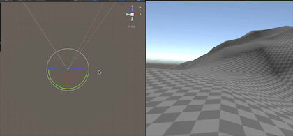

可以看出视野前方是高地时，高地后方的地形全部被剔除不会渲染。


我们再让一个Cube从摄像机前路过，可以看出被方块遮挡住的区域自动被剔除:


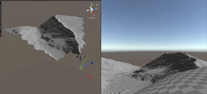

将摄像机转一圈，打印一下渲染的Patch数量，按照不同遮挡情况，Patch数量已经降为几十到几百。我们使用一个GPU Instance DrawCall就能轻松完成整个地形的渲染。


# 4. 接缝处理

在不同的LOD地块之间，会存在缝隙。这个容易理解，因为网格精度不一样，顶点不能完全对接的上。我们飞到世界边缘，看一下LOD4和LOD5之间的缝隙:

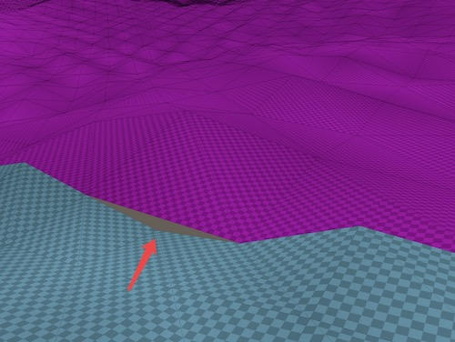

蓝色为LOD4地块，有更高精度的Mesh分辨率，箭头所指处为多出来的一个顶点。即产生缝隙的根源。

一开始我以为这种缝隙是比较难以观察的，因为它只出现在不同LOD地块的衔接处。由于摄像机附近都是高精度地块，因此这种缝隙大多在远处低精度的地块之间。

但后来我发现，这种缝隙对存在Hiz Culling的影响很大，于是修补缝隙成为了必须要处理的活。

一种修补的策略是，我们只要把多余出来的这个顶点，往旁边移动到可以衔接的位置就好了:

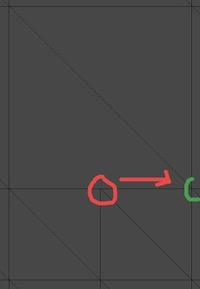

这样我们就得到了如下的效果:

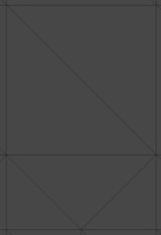

假如衔接的地块LOD相差不只1级，我们也可以使用同样的策略来修补:

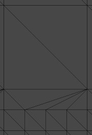

那么为了执行以上的算法，我们需要做什么准备工作呢？

## 4.1 生成LOD Map

首先我们需要生成一张LOD Map，分辨率为160 x 160。这张LOD Map上的每个像素，记录了地图上每块Sector的LOD值(注: Sector为64m x 64m，也即LOD0级的Node大小)。

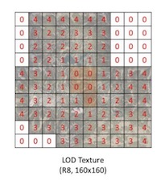

因为只有拥有了这张LODMap，我们才能通过梯度计算来知道哪些块需要进行衔接处理。

BuildLodMap作为一个单独的Pass，其时序位于四叉树分割之后，Patch生成之前。

我们可以Dispatch 160 x 160个线程去做这件事，每个线程对应LodMap中的一个像素。算法如下:

1. 设置当前LOD为5
2. 根据Sector位置，计算出其所属的LOD5级别的NodeId
3. 利用NodeId去NodeDescriptors中查询，看该Node是否被分割
4. 如未分割，则将当前LOD写入像素
5. 否则当前LOD - 1，回到2

Shader代码如下:

```hlsl
[numthreads(8,8,1)]
void BuildLodMap(uint3 id : SV_DispatchThreadID){
    uint2 sectorLoc = id.xy;
    [unroll]
    for(uint lod = MAX_TERRAIN_LOD; lod >= 0; lod --){
        uint sectorCount = GetSectorCountPerNode(lod);
        uint2 nodeLoc = sectorLoc / sectorCount;
        uint nodeId = GetNodeId(nodeLoc,lod);
        NodeDescriptor desc = NodeDescriptors[nodeId];
        if(desc.branch == 0){
            _LodMap[sectorLoc] = lod / 5.0;
            return;
        }
    }
    _LodMap[sectorLoc] = 0;
}

```

在FrameDebugger中可以查看生成的LODMap如下:

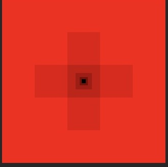

## 4.2 计算Patch的LOD Transitions

Patch的LOD Transitions计算位于裁剪工作之后。所谓LOD Transitions的计算，即我们要计算Patch在`+x,-x,+z,-z`4个方向的LOD变化情况。

我们知道,Patch是由Node拆成8x8得到的。因此我们可以先计算Patch在其对应的Node中的局部位置。只有位于Node边缘的那些Patch才是我们需要考虑的对象。

假如Patch位于左边缘，那么我们就去检测这个Node与其左侧地块的LOD之差。其他方向也是一样。

需要注意的是，我们只需要处理LOD上升的情况，而无需处理LOD下降的情况。

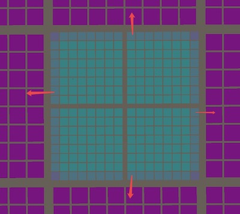

计算出LOD上升差值后，写入RenderPatch结构，供后续渲染修补使用。

在RenderPatch中，我们使用`uint4 lodTrans;`来存储4个方向的LOD梯度。

完整的LOD Trans Debug效果如下:

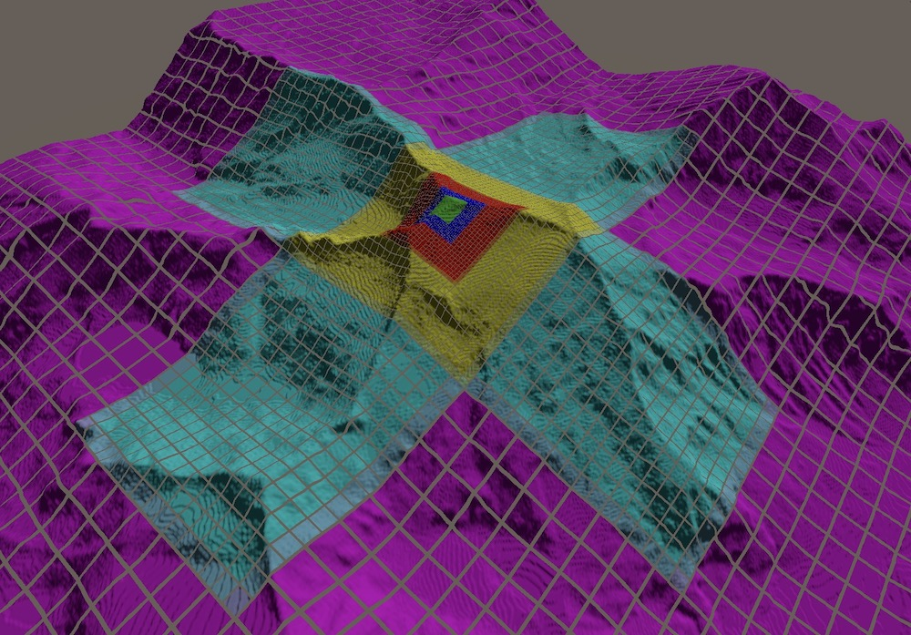

注意到我们为需要执行修补的LOD过渡区域Patch加上了颜色混合。

在地形的顶点着色器中，我们按照以下策略进行修补:

1. 检查当前顶点在Patch中是否是边缘顶点，如果不是则无需处理直接返回。否则进入2
2. 检查lodTrans的4个值，分别代表4个方向，如果大于0，则在对应方向进行修补

更细节的代码实现请参考Terrain.shader中的`FixLODConnectSeam`函数。这里不贴了。

修补效果对比如下:

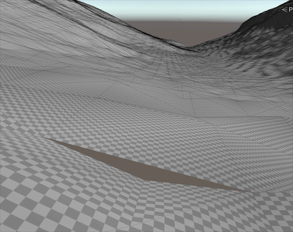


# 5. 其他

到这里，我们就完成了一个GPU-Driven地形渲染的Hello World. 还有许多细节需要完善的，例如:

- 在设计相关的GPU Struct时没做数据压缩
- Hiz Culling只使用了上一帧的DepthTexture进行裁剪，当摄像机快速转动时，结果会不够精准，导致出现物体闪现。(因为在上一帧DepthTexture中被遮蔽不代表在本帧中被遮挡)


后面有空再补充吧。


# 6. 一些补充说明

这个Demo我是在mac上开发的，后来得到一些反馈说Windows上有问题，后来我到Windows跑了一下，并做了修复，相关问题罗列于此。

## 6.1 ComputeBufferType问题

Unity中的ComputeBufferType枚举是Flags类型的，创建ComputeBuffer的时候要指定。我想当然的认为要通过`|`操作符来组合，因此使用了ComputeBufferType.Append|ComputeBufferType.Counter这种方式。在Mac上跑的时候没有问题，但是到windows会出错，然后Crash。现在看来应该是直接使用ComputeBufferType.Append就好了，Append本身就包含了Counter特性。

## 6.2 HizMap生成问题

在mac上实现的时候，我是直接将HizMap作为输入，然后将HizMap指定的mip级别作为输出。这样就无需分配额外的RenderTexture。CS实现大致如下:

```hlsl
float d1 = InTex.mips[_Mip-1][coord].r;
float d2 = InTex.mips[_Mip-1][coord + uint2(1,0)].r;
float d3 = InTex.mips[_Mip-1][coord + uint2(0,1)].r;
float d4 = InTex.mips[_Mip-1][coord + uint2(1,1)].r;
float d = min(min(d1,d2),min(d3,d4));
MipTex[id.xy] = d;
```

这里InTex和MipTex都对应同一张HizMap，但是这种方式在Windows不行，无法将一张贴图同时作为输入和输出。作为初学萌新，不知道这是底层图形库之间的区别(metal|DX)还是硬件的区别？这两天梯子倒了，暂时无法翻墙查资料，很痛苦。

目前在Win平台上采用了分配额外的RT进行PingPong来生成HizMap.


